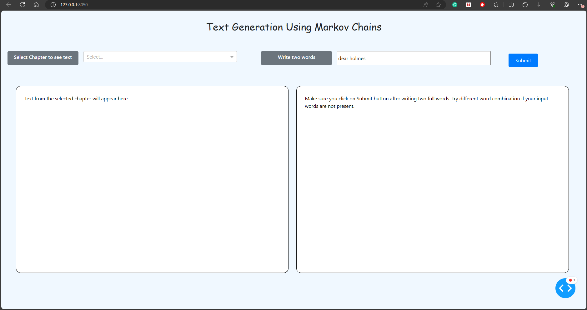
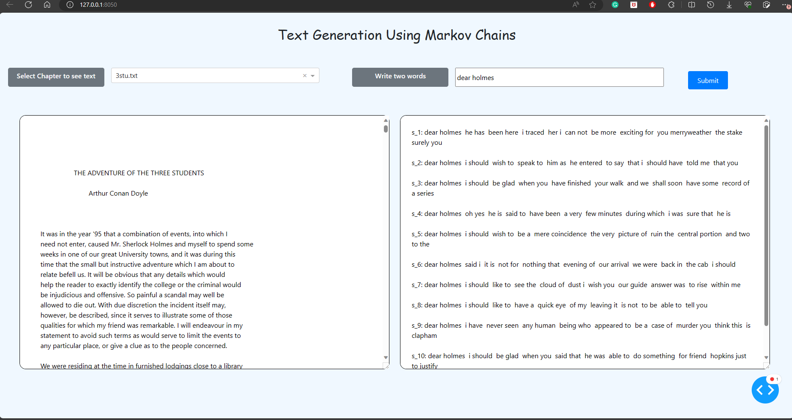

# markov-chain-text-generation

## Markov Chain Text Generation App:
    - Select a chapter from Sherlock Holmes book
    - Write two words in the text box
    - Click on Submit button to generate text based on the Markov Chain model
    - The generated text will appear in the second text box

> Markov chain is a stochastic model describing a sequence of possible events in which the probability of each event depends only on the state attained in the previous event. 

> In this app, the Markov chain is used to generate text based on the words from the selected chapter of Sherlock Holmes book. All the words from the selected chapter are used to create a Markov model.

> The Markov model is then used to generate text based on the input words. The generated text will be different each time the app is run.

> The Markov model is saved as a JSON file in the Data folder. The JSON file is loaded into a dictionary when the app is run.
    The Markov model is created using the following steps:
  
    - Read the text from the selected chapter
    - Split the text into words
    - Create a dictionary of words and their counts
    - Create a dictionary of words and their next words
    - Create a dictionary of words and their probabilities
    - Create a dictionary of words and their cumulative probabilities
    - Create a dictionary of words and their next words based on the probabilities
    - Save the Markov model as a JSON file

> Only top 5 most probable next words are used to generate text. This is done to avoid high randomness in the generated text.

> Also, a next word is selected randomly from the top 5 most probable next words to add some randomness to the generated text.

> Size of the text generated is limited to 50 words to avoid long text generation and can be changed in the generate_text function.

## Snapshots

### Step 1: Run the dash app

### Step 2: Write input words and submit
